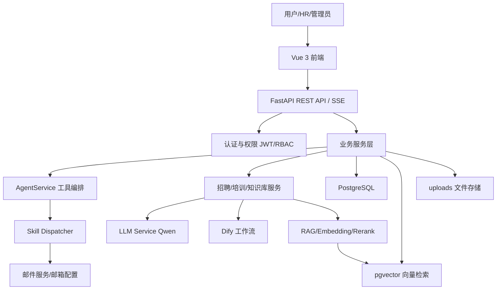
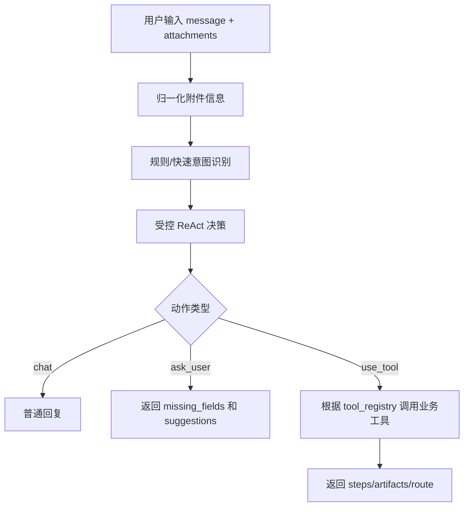
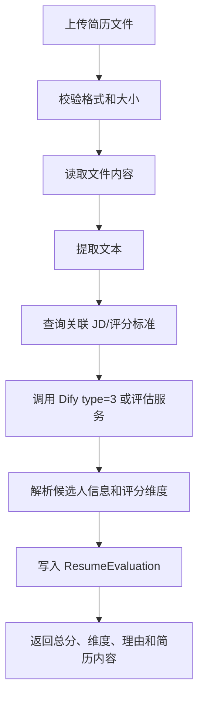
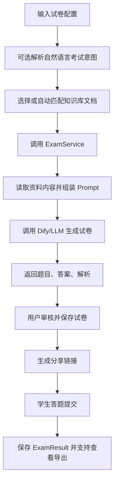
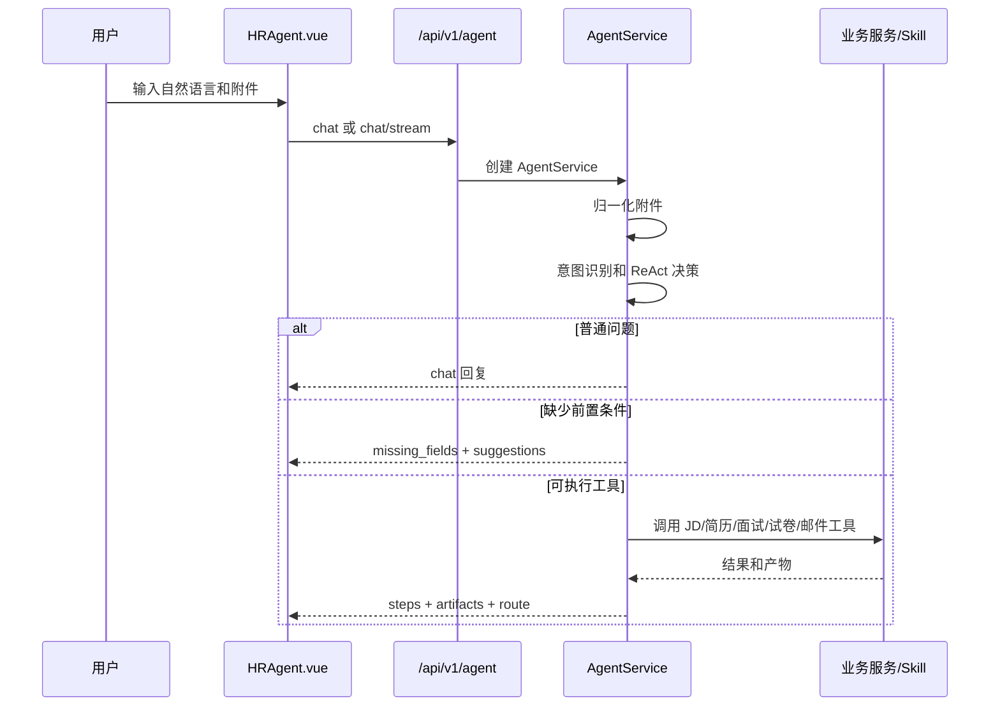
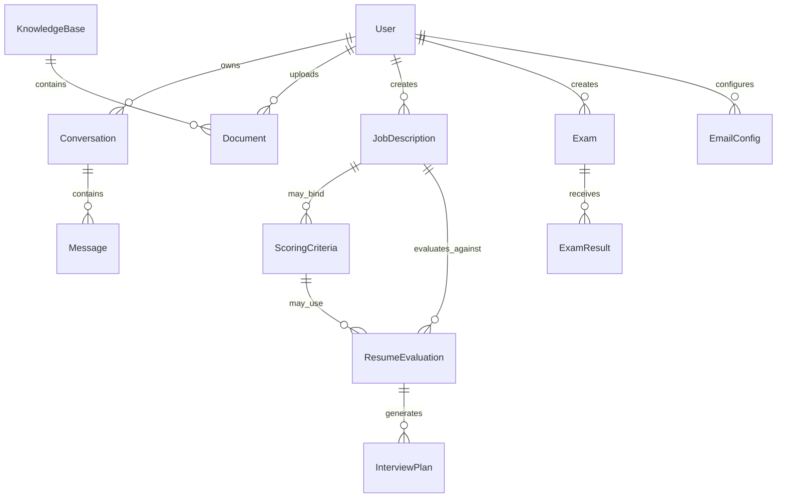
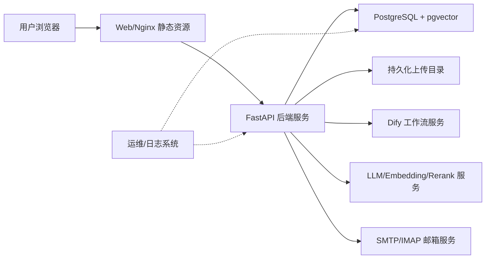

# 方案设计文档

## 1. 设计目标

方案设计目标是将 HR 招聘、培训、知识问答和系统管理需求落到可实现的应用架构中。系统采用前后端分离、后端分层服务、关系数据库 + 向量检索、LLM/Dify 工作流集成、受控 Agent 编排的方式实现。

设计原则：

- 业务优先：围绕 HR 实际工作流组织功能，而不是单纯展示 AI 能力。
- 受控自动化：AI 负责生成、分析、建议和路由，不直接替代人工做最终决策。
- 分层解耦：前端、API、Service、Model、外部 AI 服务分层清晰。
- 可追踪：关键产物保存为结构化记录，便于查询、复用和删除。
- 可扩展：新增工具可通过 Agent 工具注册表或 Skill 机制接入。

## 2. 总体架构



## 3. 前端方案

### 3.1 技术选型

- Vue 3 + Composition API
- Vite
- Vue Router
- Pinia
- Element Plus
- Axios
- ECharts
- SCSS

### 3.2 页面结构

| 模块 | 页面 | 说明 |
| --- | --- | --- |
| 认证 | 登录、注册 | 用户进入系统入口 |
| 工作台 | Dashboard、Activities | 概览统计和近期活动 |
| HR Agent | HRAgent | 自然语言对话、任务调度、步骤展示 |
| 智能招聘 | JDGenerator、ResumeScreening、SmartInterview | JD、简历筛选、面试方案 |
| 智能培训 | ExamGenerator、ExamManagement | 试卷生成、考试管理 |
| 知识助理 | KnowledgeAssistant、KnowledgeBase | 知识问答、知识库管理 |
| 系统管理 | UsersManagement、RolesManagement、EmailManagement | 用户、角色、邮箱配置 |
| 个人中心 | Profile | 用户个人信息 |
| 考试参与 | ExamShare、ExamResult | 分享考试与结果页面 |

### 3.3 前端鉴权

- 路由 `meta.requiresAuth` 控制需要登录的页面。
- Pinia auth store 保存登录状态和 Token。
- Axios 请求统一携带 Token。
- 路由守卫负责未登录跳转。
- 后端权限校验是最终安全边界。

### 3.4 前端交互方案

- 普通 CRUD 页面使用 REST API。
- JD、试卷、Agent 等长文本或多步骤任务优先使用 SSE 流式接口。
- 文件上传页面校验格式和大小，并显示上传/处理进度。
- Agent 页面展示步骤、产物、建议、缺失字段和跳转路由。

### 3.5 前端状态管理

- 登录状态、Token 和用户信息由 Pinia auth store 管理。
- 业务页面以接口返回数据为准，不在前端保存不可恢复的业务状态。
- 长任务页面需维护“生成中、已完成、失败、可重试”等状态。
- 文件上传页面应区分上传成功、处理成功和 AI 评估成功，避免用户误解。

### 3.6 前端错误处理

- 401：清理登录状态并引导重新登录。
- 403：提示权限不足，不展示敏感操作入口。
- 422：展示字段级校验错误。
- 5xx 或外部服务失败：展示失败原因和重试入口。
- SSE 中断：提示任务中断，并允许用户重试或回到业务页面继续。

## 4. 后端方案

### 4.1 技术选型

- Python 3.10+
- FastAPI
- SQLAlchemy Async
- Pydantic / Pydantic Settings
- PostgreSQL + pgvector
- JWT + OAuth2 Password Bearer
- Dify 工作流
- Qwen LLM、Embedding、Rerank
- Docker / Docker Compose

### 4.2 后端分层

| 层级 | 目录 | 职责 |
| --- | --- | --- |
| API 层 | `app/api/v1/endpoints` | 接收请求、鉴权依赖、参数绑定、返回响应 |
| Schema 层 | `app/schemas` | Pydantic 请求和响应模型 |
| Service 层 | `app/services` | 业务逻辑、AI 调用、文件处理、工作流编排 |
| Model 层 | `app/models` | SQLAlchemy 数据模型 |
| Core 层 | `app/core` | 配置、数据库、安全、中间件、异常处理 |
| Utils 层 | `app/utils` | 文件、文本、日期、校验等工具函数 |
| Scripts | `backend/scripts` | 初始化、测试、数据库管理脚本 |

### 4.3 API 模块

| 路由前缀 | 模块 | 主要能力 |
| --- | --- | --- |
| `/auth` | 认证 | 注册、登录、刷新 Token、当前用户 |
| `/users` | 用户与角色 | 用户 CRUD、角色分配、角色管理 |
| `/conversations` | 对话管理 | 会话和消息 CRUD |
| `/documents` | 文档 | 上传、处理、切片、查询、删除 |
| `/knowledge-base` | 知识库 | 集合管理、知识库查询 |
| `/knowledge-assistant` | 知识助手 | 配置、问答、文档列表、自动选择知识库 |
| `/chat` | 通用对话 | 普通对话、流式对话、反馈 |
| `/agent` | HR Agent | Agent 对话、流式执行、简历/面试/试卷流式接口 |
| `/hr-workflows` | HR 工作流 | 需求解析、JD、评分标准、简历评估、面试方案、试卷 |
| `/job-descriptions` | JD | 保存、查询、更新、删除 |
| `/scoring-criteria` | 评分标准 | 保存、查询、更新、删除 |
| `/resume-evaluation` | 简历评估 | 自动评估、历史、状态、导出 |
| `/interview-plans` | 面试方案 | 保存、查询、更新、删除 |
| `/exam-management` | 考试管理 | 试卷、分享、考试结果 |
| `/email-configs` | 邮箱配置 | 配置、测试、抓取、日志 |
| `/stats` | 统计 | 工作台、趋势、活动 |
| `/intent` | 意图路由 | 意图识别和需求解析 |

### 4.4 服务层职责

| 服务 | 职责 |
| --- | --- |
| `AgentService` | 意图识别、工具选择、步骤输出、业务工具编排 |
| `IntentService` | 快速意图分类、需求解析 |
| `JobDescriptionService` | JD 保存、查询、更新、删除 |
| `ScoringCriteriaService` | 评分标准保存和管理 |
| `ResumeEvaluationService` | 简历上传解析、AI 评分、历史记录 |
| `InterviewPlanService` | 面试方案保存和管理 |
| `ExamService` | 试卷生成、试卷管理、考试提交 |
| `DocumentService` | 文档上传、提取、处理、切片 |
| `KnowledgeBaseService` | 知识库集合、文档归属、搜索 |
| `RagService` | 检索增强问答流程 |
| `EmbeddingService` | 文本向量化 |
| `RerankService` | 检索结果重排 |
| `DifyService` | Dify 工作流同步和流式调用 |
| `EmailSendService` | 邮件发送或草稿相关能力 |
| `EmailScheduler` | 邮件抓取调度 |

### 4.5 模块级详细设计

本节从模块内部说明输入、处理链路、服务协作、数据落点、输出和失败处理，作为研发实现、联调和测试设计的依据。

#### 4.5.1 认证与用户权限模块

模块目标：为系统提供登录、注册、当前用户识别、用户管理、角色分配和管理员权限控制。

| 设计项 | 说明 |
| --- | --- |
| 前端入口 | `Login.vue`、`Register.vue`、`UsersManagement.vue`、`RolesManagement.vue` |
| API | `/auth/*`、`/users/*` |
| Schema | `auth.py`、`user.py` |
| Service | `UserService`、`RoleService` |
| Model | `User`、`Role`、`UserRoleAssociation` |
| 安全依赖 | `get_current_user`、`get_current_superuser`、`get_current_admin_by_role` |

处理流程：

1. 用户注册或管理员创建用户时，后端校验用户名、邮箱和密码长度。
2. 密码通过 bcrypt 哈希后保存。
3. 用户登录时校验邮箱和密码，成功后签发 JWT。
4. 前端保存 Token，后续请求通过 `Authorization: Bearer <token>` 传递。
5. 后端依赖函数解析 Token，查询当前用户并校验是否启用。
6. 管理类接口继续校验超级管理员或角色权限。

失败处理：

| 场景 | 处理 |
| --- | --- |
| 邮箱或用户名重复 | 返回 409 或业务错误 |
| 密码不足 6 位 | 返回 422 |
| Token 缺失或无效 | 返回 401 |
| 用户停用 | 返回 400 或 403 |
| 非管理员访问管理接口 | 返回 403 |

设计约束：

- 前端路由守卫只做体验控制，权限边界必须以后端依赖校验为准。
- 生产环境必须替换默认 `SECRET_KEY`。
- 密码、Token、邮箱授权码不得写入普通日志。

#### 4.5.2 HR Agent 编排模块

模块目标：将用户自然语言输入转化为受控业务动作，完成意图识别、前置条件判断、工具选择、步骤输出和产物返回。

| 设计项 | 说明 |
| --- | --- |
| 前端入口 | `HRAgent.vue` |
| API | `/agent/chat`、`/agent/chat/stream`、`/agent/*/stream` |
| Schema | `AgentChatRequest`、`AgentChatResponse`、`AgentStep`、`AgentArtifact` |
| Service | `AgentService`、`IntentService`、`AgentSkillDispatcher` |
| 依赖服务 | JD、简历评估、面试方案、试卷、邮箱 Skill |

处理链路：



工具选择规则：

| intent | 工具 | 前置条件 | 输出 |
| --- | --- | --- | --- |
| `jd` | `generate_jd` | 岗位需求或岗位名称 | JD 产物、JD 页面路由 |
| `resume_screening` | `evaluate_resume` | 简历附件、JD | 评分结果、简历筛选路由 |
| `interview_plan` | `generate_interview_plan` | 已评分候选人 | 面试方案 |
| `exam_generate` | `generate_exam` | 参考文档、试卷配置 | 试卷内容 |
| `resource_delete` | `delete_resource` | 资源类型和名称 | 确认提示或删除结果 |
| `email_notification` | 邮件 Skill | 收件人、主题、内容 | 草稿或确认请求 |

失败处理：

| 场景 | 处理 |
| --- | --- |
| 意图不明确 | 普通回复或追问，不误触发工具 |
| 缺少前置条件 | 返回 `missing_fields` |
| 工具执行失败 | `steps` 标记 failed，返回错误摘要 |
| SSE 中断 | 前端展示中断并允许重试 |
| 删除/发送等高风险动作 | 必须要求用户确认 |

设计约束：

- Agent 只能调用工具注册表声明过的工具。
- 不暴露模型完整内部推理，只输出简短业务判断摘要。
- Agent 产物必须允许用户编辑、保存或确认。

#### 4.5.3 JD 生成与管理模块

模块目标：支持自然语言招聘需求解析、JD 生成、JD 保存、查询、更新、删除，并作为后续评分标准和简历评估的基础数据。

| 设计项 | 说明 |
| --- | --- |
| 前端入口 | `JDGenerator.vue` |
| API | `/hr-workflows/parse-requirements`、`/hr-workflows/generate-jd`、`/job-descriptions/*` |
| Schema | `JDGenerateRequest`、`JobDescriptionCreate`、`JobDescriptionUpdate` |
| Service | `DifyService`、`JobDescriptionService` |
| Model | `JobDescription` |

处理流程：

1. 用户输入岗位需求，前端可调用需求解析接口填充表单。
2. 后端构造 Dify 工作流输入，调用 type=1 生成 JD。
3. 若 `stream=true`，后端通过流式响应返回生成片段。
4. 用户编辑 JD 后调用保存接口。
5. 后端写入 `JobDescription`，记录创建人、状态、元数据和工作流类型。
6. 列表和详情接口用于历史查询、复用和后续绑定评分标准。

关键字段：

| 字段 | 说明 |
| --- | --- |
| `title` | JD 标题，保存必填 |
| `content` | JD 正文，保存必填 |
| `requirements` | 用户原始需求 |
| `skills` | 技能标签 |
| `status` | 草稿、启用、归档等状态 |
| `conversation_id` | 关联 Agent 或对话 |

失败处理：

| 场景 | 处理 |
| --- | --- |
| 需求为空 | 返回 422 或前端阻止提交 |
| Dify 超时 | 返回生成失败，保留用户输入 |
| 保存字段缺失 | 返回字段校验错误 |
| 查询不存在 JD | 返回 404 |
| 删除存在关联记录的 JD | 试点默认逻辑下线或软删除，不破坏关联数据 |

#### 4.5.4 评分标准模块

模块目标：基于 JD 生成结构化评分标准，为简历评估提供一致评分口径。

| 设计项 | 说明 |
| --- | --- |
| 前端入口 | `JDGenerator.vue`、`ResumeScreening.vue` |
| API | `/hr-workflows/generate-scoring-criteria`、`/scoring-criteria/*` |
| Schema | `ScoringCriteriaGenerateRequest`、`ScoringCriteriaCreate`、`ScoringCriteriaUpdate` |
| Service | `DifyService`、`ScoringCriteriaService` |
| Model | `ScoringCriteria` |

处理流程：

1. 用户选择或生成 JD。
2. 前端提交 JD 内容和岗位标题。
3. 后端调用 Dify type=2 生成评分标准。
4. 用户审核维度、权重、总分和说明。
5. 保存评分标准，并可绑定 `job_description_id`。
6. 简历评估时可选用该评分标准。

数据设计：

| 字段 | 说明 |
| --- | --- |
| `title` | 评分标准标题 |
| `content` | 评分标准正文 |
| `total_score` | 总分，默认 100 |
| `scoring_dimensions` | 维度化评分结构 |
| `job_description_id` | 关联 JD |

失败处理：

| 场景 | 处理 |
| --- | --- |
| JD 内容为空 | 前端阻止生成或后端返回 422 |
| Dify 返回非结构化内容 | 保存正文，结构化维度为空或提示用户修正 |
| 权重口径不一致 | 前端提示人工确认 |
| 删除评分标准 | 删除前二次确认，不影响已有评估历史展示 |

#### 4.5.5 简历评估模块

模块目标：支持简历文件上传、文本提取、关联 JD、调用 AI 评估、保存评估结果、历史查询、状态更新和导出。

| 设计项 | 说明 |
| --- | --- |
| 前端入口 | `ResumeScreening.vue` |
| API | `/resume-evaluation/evaluate-auto`、`/hr-workflows/evaluate`、`/resume-evaluation/history` |
| Schema | `ResumeEvaluationResult`、`ResumeEvaluationResponse` |
| Service | `ResumeEvaluationService`、`DifyService` |
| Model | `ResumeEvaluation` |
| 文件依赖 | PDF/DOC/DOCX/TXT 解析能力 |

处理链路：



输入输出：

| 类型 | 内容 |
| --- | --- |
| 输入 | 简历文件、`job_description_id`、可选 `scoring_criteria_id`、`conversation_id` |
| 输出 | 候选人信息、总分、维度评分、评分理由、简历文本、评估 ID |
| 入库 | 文件名、文件类型、简历文本、候选人字段、评分结果、关联 JD 和用户 |

失败处理：

| 场景 | 处理 |
| --- | --- |
| 文件为空 | 返回 400 |
| 文件格式不支持 | 返回格式错误 |
| JD ID 非法或不存在 | 返回 400/404 |
| 文本提取失败 | 返回解析失败，允许重新上传 |
| Dify/AI 评估失败 | 返回评估服务暂不可用 |
| 重复上传 | 试点默认生成新记录，不覆盖旧记录 |

设计约束：

- AI 评分仅作为辅助判断。
- 简历原文和候选人信息属于敏感数据，需按权限访问。
- 评估结果应可复核、可追踪、可导出。

#### 4.5.6 面试方案模块

模块目标：基于已评分简历和关联 JD 生成可供面试官使用的结构化面试方案。

| 设计项 | 说明 |
| --- | --- |
| 前端入口 | `SmartInterview.vue` |
| API | `/hr-workflows/generate-interview-plan-by-resume`、`/interview-plans/*` |
| Schema | `InterviewPlanCreate`、`InterviewPlanSaveRequest`、`InterviewPlanResponse` |
| Service | `InterviewPlanService`、`JobDescriptionService`、`DifyService` |
| Model | `InterviewPlan`、`ResumeEvaluation`、`JobDescription` |

处理流程：

1. 用户选择一条已完成的简历评估记录。
2. 后端校验该记录属于当前用户或授权范围。
3. 后端读取简历内容和关联 JD 内容。
4. 调用 Dify type=4 生成面试方案。
5. 用户编辑后保存为 `InterviewPlan`。
6. 列表和详情接口支持后续查看、更新和删除。

输出内容：

- 面试目标
- 面试流程
- 核心问题
- 追问建议
- 考察维度
- 评分建议
- 候选人风险点

失败处理：

| 场景 | 处理 |
| --- | --- |
| 简历评估不存在 | 返回 404 |
| 关联 JD 不存在 | 返回 404 |
| Dify 生成失败 | 返回失败提示，允许重试 |
| 保存缺少候选人或正文 | 返回 422 |

#### 4.5.7 文档与知识库模块

模块目标：支持企业资料上传、文本提取、切片、向量化、知识库归属管理和知识助手问答。

| 设计项 | 说明 |
| --- | --- |
| 前端入口 | `KnowledgeBase.vue`、`KnowledgeAssistant.vue` |
| API | `/documents/*`、`/knowledge-base/*`、`/knowledge-assistant/*` |
| Schema | `DocumentUpload`、`DocumentSearch`、`KnowledgeBaseCreate`、`KnowledgeBaseSearch` |
| Service | `DocumentService`、`KnowledgeBaseService`、`RagService`、`EmbeddingService`、`RerankService` |
| Model | `Document`、`KnowledgeBase`、`FAQ` |
| 存储 | PostgreSQL + pgvector、uploads 文件目录 |

文档处理流程：

1. 用户上传文档，可选择知识库、分类和标签。
2. 后端保存原始文件到上传目录。
3. 后端记录文件元数据、哈希、大小、MIME 类型。
4. 用户触发处理后，系统提取文本。
5. 文本切片并调用 Embedding 服务生成向量。
6. 向量写入 pgvector，文档进入可检索状态。

知识问答流程：

1. 用户输入问题，可指定知识库。
2. 系统进行知识库选择或使用指定知识库。
3. 执行查询增强、向量召回、文本匹配。
4. Rerank 服务对候选上下文重排。
5. 将上下文传给 LLM 生成回答。
6. 返回答案、来源片段和置信度。

失败处理：

| 场景 | 处理 |
| --- | --- |
| 文件上传失败 | 返回上传错误 |
| 文档为空或解析失败 | 标记处理失败，允许重新处理 |
| Embedding 失败 | 文档不可检索，允许重试 |
| Rerank 失败 | 降级为原始召回排序 |
| 无相关知识 | 提示资料不足，不强行回答 |
| 删除文档 | 同步清理切片和向量数据，至少确保不再被检索 |

#### 4.5.8 试卷生成与考试模块

模块目标：基于培训资料和配置生成试卷，支持试卷保存、分享、答题提交、结果查看和导出。

| 设计项 | 说明 |
| --- | --- |
| 前端入口 | `ExamGenerator.vue`、`ExamManagement.vue`、`ExamShare.vue`、`ExamResult.vue` |
| API | `/hr-workflows/papers/*`、`/exam-management/*` |
| Schema | `ExamGenerateRequest`、`ExamCreateRequest`、`ExamSubmitRequest` |
| Service | `ExamService`、`KBSelectionService`、`DifyService` |
| Model | `Exam`、`Question`、`ExamResult` |

处理流程：



关键输入：

- 标题、科目、总分
- 难度、时长
- 题型和题量
- 参考资料
- 特殊要求

失败处理：

| 场景 | 处理 |
| --- | --- |
| 缺少标题/科目/总分 | 返回 422 |
| 知识文件不可用 | 提示重新选择资料 |
| 生成失败 | 返回失败提示，允许重试 |
| 试卷已有答题结果 | 默认不直接修改，建议复制为新版本 |
| 提交答案失败 | 返回提交失败，不重复写入结果 |

#### 4.5.9 邮箱配置与邮件 Skill 模块

模块目标：支持招聘邮箱配置、连接测试、邮件抓取、日志查看，并为 Agent 邮件通知能力提供基础。

| 设计项 | 说明 |
| --- | --- |
| 前端入口 | `EmailManagement.vue` |
| API | `/email-configs/*` |
| Schema | `EmailConfigCreate`、`EmailConfigUpdate`、`EmailConnectionTest`、`EmailFetchLog` |
| Service | `EmailScheduler`、`EmailSendService`、Skill 脚本 |
| Model | `EmailConfig`、`EmailFetchLog` |
| 权限 | 仅超级管理员 |

处理流程：

1. 超级管理员填写 IMAP/SMTP 配置。
2. 后端保存配置，密码或授权码不得明文回显。
3. 管理员触发连接测试，后端尝试连接邮箱服务。
4. 管理员可手动抓取邮件或开启自动抓取。
5. 抓取结果写入日志，供排障和后续简历处理使用。
6. Agent 邮件通知只生成草稿或确认请求，不绕过人工确认。

失败处理：

| 场景 | 处理 |
| --- | --- |
| 非超级管理员访问 | 返回 403 |
| IMAP/SMTP 连接失败 | 返回连接错误和原因 |
| 邮箱认证失败 | 返回认证失败，不启动自动抓取 |
| 抓取失败 | 写入 `EmailFetchLog` |
| 发送失败 | 返回失败结果，不重复发送 |

#### 4.5.10 统计看板模块

模块目标：提供工作台概览、招聘趋势、培训完成情况和近期活动，帮助管理者观察试点运行情况。

| 设计项 | 说明 |
| --- | --- |
| 前端入口 | `Dashboard.vue`、`Activities.vue` |
| API | `/stats/dashboard`、`/stats/recruitment-trend`、`/stats/training-completion`、`/stats/recent-activities` |
| Service | `StatsService` |
| 数据来源 | JD、简历评估、面试方案、试卷、考试结果、文档、活动记录 |

处理流程：

1. 前端进入工作台后请求统计接口。
2. 后端按当前用户权限聚合业务数据。
3. 返回概览数字、趋势数据和近期活动。
4. 前端用卡片、列表或图表展示。

失败处理：

| 场景 | 处理 |
| --- | --- |
| 无数据 | 返回空数组或 0，前端展示空态 |
| 权限不足 | 返回 403 |
| 单个统计源异常 | 记录日志，按可用数据返回或整体失败 |

## 5. Agent 编排设计

### 5.1 设计定位

当前 Agent 是受控工具编排层，不是无限自主执行的通用智能体。它通过固定工具注册表、意图识别、前置条件判断、路由推荐和流式步骤输出，帮助用户从自然语言进入 HR 业务流程。

### 5.2 工具注册表

| 工具 | intent | 路由 | 前置条件 |
| --- | --- | --- | --- |
| JD 生成 | `jd` | `/recruitment/jd-generator` | 岗位名称、地点、薪资、经验、学历 |
| 简历评分 | `resume_screening` | `/recruitment/resume-screening` | 简历文件、匹配 JD |
| 面试方案 | `interview_plan` | `/recruitment/smart-interview` | 已评分候选人 |
| 试卷生成 | `exam_generate` | `/training/exam-generator` | 参考文档、试卷配置 |
| 资源删除 | `resource_delete` | 无固定路由 | 资源类型和名称 |
| 邮件通知 | `email_notification` | Skill 配置决定 | 收件人、主题、内容、确认 |

### 5.3 决策流程



### 5.4 输出结构

Agent 输出应包含：

- `reply`：给用户看的自然语言回复。
- `steps`：任务判断、工具选择、执行状态。
- `artifacts`：生成的 JD、评分结果、面试方案、试卷等产物。
- `suggestions`：下一步建议。
- `missing_fields`：缺失条件。
- `route`：推荐跳转页面。

### 5.5 Agent 安全边界

- Agent 只能调用工具注册表中声明的工具。
- Agent 决策动作限制为普通回复、调用工具、追问用户。
- 删除、发送通知等高风险动作必须确认。
- Agent 不应暴露模型完整内部推理，只展示简短业务推理摘要。
- Agent 输出的业务产物仍需进入页面编辑、保存或确认流程。

## 6. 数据设计

### 6.1 主要实体

| 实体 | 说明 |
| --- | --- |
| User | 用户基础信息、角色、登录状态、个人资料 |
| Role | 角色名称、描述、内置角色标记 |
| Conversation / Message | 对话和消息历史 |
| Document | 上传文档、文件元数据、处理状态 |
| KnowledgeBase / FAQ | 知识库集合和常见问答 |
| JobDescription | JD 内容、岗位信息、状态 |
| ScoringCriteria | 简历评分标准 |
| ResumeEvaluation | 简历评分结果、候选人信息、状态 |
| InterviewPlan | 面试方案内容 |
| Exam / Question | 试卷和题目 |
| ExamResult | 答题结果和得分 |
| EmailConfig / EmailFetchLog | 邮箱配置和抓取日志 |

### 6.2 数据存储

- 结构化业务数据存储在 PostgreSQL。
- 文档向量存储依赖 PostgreSQL + pgvector。
- 上传原始文件存储在 `uploads` 目录。
- 对话历史和 AI 产物保存为数据库记录，便于后续查询。

### 6.3 数据生命周期

- 上传文件：上传后保存元数据，处理后生成文本切片和向量。
- JD/评分标准：生成后由用户确认保存，支持更新和删除。
- 简历评估：上传和评估后生成记录，支持状态更新和删除。
- 试卷：生成后保存为试卷记录，支持分享和结果关联。
- 邮件日志：抓取和测试过程应保留日志，便于排障。

### 6.4 核心实体关系



### 6.5 状态流转建议

| 对象 | 状态 | 说明 |
| --- | --- | --- |
| JD | draft、active、archived | 草稿、启用、归档 |
| 评分标准 | draft、active、archived | 草稿、启用、归档 |
| 简历评估 | pending、processing、completed、failed、shortlisted、rejected | 待处理、处理中、完成、失败、进入候选、淘汰 |
| 文档 | uploaded、processing、processed、failed | 已上传、处理中、已处理、失败 |
| 试卷 | draft、published、closed | 草稿、已发布、已结束 |
| Agent 步骤 | pending、running、completed、failed | 待执行、执行中、完成、失败 |

## 7. RAG 与知识库方案

### 7.1 文档处理

1. 用户上传 PDF、Word、TXT 等资料。
2. 后端校验文件大小和格式。
3. 文档服务提取文本。
4. 文本切片。
5. Embedding 服务生成向量。
6. 写入 pgvector。

### 7.2 查询流程

1. 用户输入问题。
2. 系统进行查询改写和扩展。
3. 进行向量召回和文本匹配。
4. Rerank 服务重排候选上下文。
5. 将上下文交给 LLM 生成回答。
6. 返回答案和相关文档依据。

### 7.3 质量控制

- 设置最低相似度阈值。
- 支持 rerank 开关和 top-k 参数。
- 无相关知识时提示用户，而不是强行编造答案。

## 8. 外部服务集成

| 服务 | 用途 | 配置项 |
| --- | --- | --- |
| Dify | JD、简历解析、试卷等工作流 | `DIFY_BASE_URL`、`DIFY_API_KEY`、`DIFY_USER_ID` |
| LLM | 文本生成、意图判断、问答 | `LLM_API_KEY`、`LLM_BASE_URL`、`LLM_MODEL` |
| Embedding | 文档向量化 | `EMBEDDING_API_KEY`、`EMBEDDING_MODEL` |
| Rerank | 检索结果重排 | `QWEN_API_KEY`、`QWEN_MODEL` |
| 邮箱服务 | 邮件抓取、测试、草稿/发送能力 | EmailConfig 数据表 |

### 8.1 外部服务失败策略

| 服务 | 失败表现 | 处理策略 |
| --- | --- | --- |
| Dify | 工作流超时、返回异常、网络不可达 | 返回失败步骤，提示重试或走人工流程 |
| LLM | 内容生成失败、响应超时 | 保留用户输入，允许重新生成 |
| Embedding | 文档无法向量化 | 文档标记处理失败，允许重新处理 |
| Rerank | 重排失败 | 可降级为向量召回原始排序 |
| 邮箱 | 连接失败或认证失败 | 返回连接测试错误，不启动发送 |

### 8.2 配置管理

- 所有外部服务地址、模型名和密钥应通过 `.env` 或企业密钥系统注入。
- 生产环境不得使用仓库中的默认示例密钥。
- 配置变更需要记录变更人、时间和影响范围。

## 9. 权限与安全设计

### 9.1 认证

- 登录成功后签发 JWT。
- 后端通过 OAuth2 Bearer Token 获取当前用户。
- Token 载荷中包含用户 ID，并设置过期时间。
- 密码使用 bcrypt 哈希。

### 9.2 授权

- 基础接口要求 `get_current_user`。
- HR 相关接口可按需要使用 HR 角色依赖。
- 超级管理员接口使用 `get_current_superuser` 或 `get_current_admin_by_role`。
- 邮箱配置、用户管理、角色管理应仅允许超级管理员访问。

### 9.3 敏感信息

- 生产环境必须替换默认密钥、数据库密码和 API Key。
- 不允许在前端暴露 LLM、Dify、邮箱密码等敏感配置。
- 上传的简历、候选人信息、考试结果应按企业数据安全要求限制访问和留存。

### 9.4 安全控制点

| 控制点 | 设计 |
| --- | --- |
| 登录认证 | JWT Bearer Token |
| 密码保存 | bcrypt 哈希 |
| 管理接口 | 超级管理员依赖校验 |
| 邮箱配置 | 仅超级管理员访问 |
| 文件上传 | 大小和格式限制 |
| 简历数据 | 仅授权用户访问，生产需明确保留期限 |
| AI 输出 | 人工确认后用于业务流程 |
| 对外通知 | 不允许绕过确认自动发送 |

## 10. 异常处理设计

### 10.1 统一错误结构

后端异常处理返回统一结构：

```json
{
  "error": {
    "message": "错误信息",
    "type": "错误类型",
    "details": {}
  }
}
```

### 10.2 主要异常场景

| 场景 | 处理方式 |
| --- | --- |
| 未登录或 Token 无效 | 返回 401 |
| 权限不足 | 返回 403 |
| 参数校验失败 | 返回 422，包含字段错误 |
| 唯一约束冲突 | 返回 409 |
| 外键引用无效 | 返回 400 |
| 资源不存在 | 返回 404 |
| 数据库异常 | 记录日志，返回可理解错误 |
| LLM/Dify 超时或失败 | 返回失败状态和重试建议 |
| 文件解析失败 | 返回文件名、失败原因和可接受格式 |

### 10.3 前端展示

- 表单错误展示字段级提示。
- 接口错误展示业务可理解提示。
- 长任务失败时展示已完成步骤和失败原因。
- 权限错误跳转或提示联系管理员。

### 10.4 日志设计

建议记录以下日志：

- 应用启动、关闭、数据库初始化。
- 登录失败、Token 校验失败、权限不足。
- 文件上传、处理、解析失败。
- Dify、LLM、Embedding、Rerank 调用失败。
- Agent 工具选择、执行失败和高风险操作确认。
- 数据库完整性冲突和外键引用失败。

日志中应避免记录明文密码、完整密钥和不必要的简历敏感信息。

## 11. 部署方案

### 11.1 开发部署

- 后端：`python main.py` 或 `uvicorn main:app --reload --host 0.0.0.0 --port 8000`
- 前端：`npm run dev`，默认 `http://localhost:3000`
- 数据库：`backend/docker-compose.yml` 启动 PostgreSQL + pgvector

### 11.2 生产部署建议

- 前端构建为静态文件，由 Nginx 或企业 Web 服务托管。
- 后端以 Uvicorn/Gunicorn 或容器方式部署。
- 数据库使用独立 PostgreSQL 实例并启用 pgvector。
- `.env` 由运维或密钥管理系统注入。
- 上传目录需要持久化卷。
- 日志需要接入企业日志平台或至少保留滚动文件。
- LLM/Dify/Embedding/Rerank 服务需要网络连通性和密钥。

### 11.3 部署拓扑



### 11.4 环境分层

| 环境 | 用途 | 特点 |
| --- | --- | --- |
| 开发环境 | 本地开发和调试 | 可使用本地数据库和测试 Key |
| 测试环境 | 联调和测试执行 | 数据可重置，外部服务使用测试配置 |
| UAT 环境 | 业务验收 | 尽量接近生产，使用脱敏测试数据 |
| 生产环境 | 正式试点或上线 | 密钥、备份、日志、权限必须满足上线条件 |

## 12. 可扩展设计

- 新增 HR 工具时，在 Service 层实现业务逻辑，并在 Agent 工具注册表中声明 intent、route、description、prerequisites。
- 新增 Skill 时，在 `backend/skills` 下维护 `SKILL.md`、`skill.json`、脚本和参考资料，并由 dispatcher 接入。
- 新增页面时，在 `frontend/src/views`、`frontend/src/api` 和 router 中补齐页面、接口和菜单。
- 新增数据实体时，补充 model、schema、service、endpoint 和迁移脚本。

## 13. 方案评审检查点

- 架构是否覆盖全部 P0 业务流程。
- Agent 的工具边界和确认机制是否清晰。
- 数据实体是否支撑查询、保存、删除、复用和审计。
- 外部 AI 服务失败是否有降级或提示。
- 权限控制是否以后端校验为准。
- 上传目录、数据库和日志是否具备生产化准备。
- 是否明确哪些能力属于项目内实现，哪些依赖企业平台。
