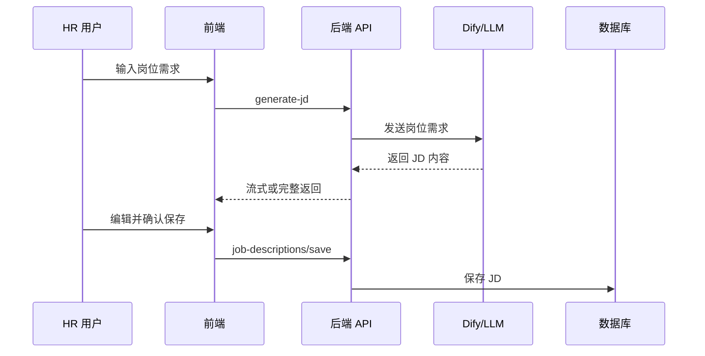
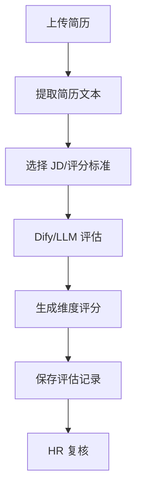
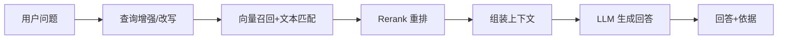

# AI 工作流与质量控制说明

## 1. 文档目的

本文档说明 HR Agent 项目中 AI 能力的使用边界、工作流设计、质量控制、人工审核、失败兜底和验收方法，避免将 AI 输出误解为不可解释或不可控的自动决策。

## 2. AI 能力范围

| 场景 | AI 能力 | 输出 | 人工角色 |
| --- | --- | --- | --- |
| JD 生成 | 根据岗位需求生成职位描述 | JD 初稿 | HR 编辑和确认 |
| 评分标准生成 | 根据 JD 生成评分维度 | 评分标准 | HR 调整权重和维度 |
| 简历评估 | 解析简历并与 JD 匹配 | 总分、维度、理由 | HR 复核 |
| 面试方案 | 根据简历和 JD 生成面试建议 | 问题、重点、评分建议 | 面试官选择和修改 |
| 知识问答 | 基于知识库检索增强回答 | 回答和依据 | 用户判断是否采纳 |
| 试卷生成 | 根据资料生成题目 | 试卷、答案、解析 | 培训管理员审核 |
| Agent 编排 | 识别意图并选择工具 | 步骤、路由、产物 | 用户确认执行 |
| 邮件通知 | 生成草稿或通知内容 | 邮件草稿 | HR 确认发送 |

## 3. AI 边界声明

- AI 结果是辅助产物，不是最终人事决策。
- 简历评分不能直接作为录用或淘汰依据。
- 邮件通知不得绕过人工确认自动发送。
- 知识问答在无相关资料时应提示不确定。
- Agent 只能调用系统声明的工具，不能自由执行任意代码或任意外部操作。

## 4. JD 生成工作流

质量要求：

- 岗位名称、职责、任职要求、技能、经验、学历、地点应清晰。
- 内容应避免歧视性或不合规表达。
- 输出应保留 HR 编辑空间。

## 5. 评分标准生成工作流

输入：

- JD 正文
- 岗位标题
- 可选岗位要求结构化信息

输出：

- 总分
- 评分维度
- 每个维度的说明、权重和评分建议

质量要求：

- 维度之和应与总分口径一致。
- 维度应覆盖硬技能、项目经验、行业背景、沟通能力、岗位匹配度等。
- 不能只给总分，必须给评分理由。

## 6. 简历评估工作流

质量要求：

- 评分结果应包括总分、维度分、理由。
- 高匹配简历应明显高于低匹配简历。
- 若简历解析失败，应明确提示，不应生成虚假评分。
- 评估理由应引用简历中的能力、项目或经历。

## 7. 面试方案工作流

输入：

- 简历评估 ID
- 候选人姓名
- 应聘岗位

输出：

- 面试目标
- 面试流程
- 核心问题
- 追问建议
- 风险点
- 评分建议

质量要求：

- 问题应和 JD、简历、评分结果相关。
- 对低分维度应给出追问建议。
- 方案应面向面试官可直接使用，而不是泛泛模板。

## 8. RAG 知识问答工作流

质量要求：

- 对文档内明确事实问题，回答应与原文一致。
- 对文档外问题，应提示没有足够资料。
- 回答应尽量提供来源或依据片段。
- 不应把通用知识伪装成企业文档结论。

## 9. 试卷生成工作流

输入：

- 试卷标题
- 科目
- 难度
- 时长
- 总分
- 题型和题量
- 参考资料
- 特殊要求

输出：

- 试卷正文
- 题目列表
- 答案
- 解析

质量要求：

- 题目应来自或围绕参考资料。
- 题型和题量应符合配置。
- 答案和解析应可人工审核。
- 生成后必须允许培训管理员编辑。

## 10. Agent 决策质量

Agent 应符合以下规则：

| 输入 | 预期行为 |
| --- | --- |
| “你好” | 普通回复，不调用工具 |
| “帮我生成前端工程师 JD” | 识别 `jd` |
| “帮我筛选简历”但无附件 | 追问简历文件和 JD |
| 上传简历并说“帮我评分” | 识别 `resume_screening` |
| 上传文档并说“生成试卷” | 识别 `exam_generate` |
| “删除刚才的 JD” | 识别高风险操作，要求确认 |
| “给候选人发面试通知” | 生成草稿或要求确认，不直接发送 |

## 11. AI 质量测试集

建议建立固定测试集：

| 测试集 | 数据 |
| --- | --- |
| JD 测试集 | 前端工程师、后端工程师、AI 产品经理 |
| 简历测试集 | 高匹配、中匹配、低匹配各 1-2 份 |
| 知识库测试集 | HR 制度、培训资料、岗位说明 |
| 试卷测试集 | 1 份可验证答案的培训资料 |
| Agent 测试集 | 常见指令、模糊指令、高风险指令 |

## 12. 质量评分标准

| 维度 | 评分说明 |
| --- | --- |
| 完整性 | 是否覆盖应有结构和字段 |
| 相关性 | 是否与输入需求、文档、简历相关 |
| 可解释性 | 是否给出理由、依据、维度 |
| 可编辑性 | 是否方便用户修改和保存 |
| 稳定性 | 多次运行结果是否大体一致 |
| 安全性 | 是否避免越权、自动决策和敏感泄露 |

建议验收口径：

- 5 分：可直接使用，仅需少量编辑。
- 4 分：结构完整，需要正常人工修改。
- 3 分：可作为参考，但需要明显重写。
- 2 分：相关性不足，不能进入业务流程。
- 1 分：错误、虚构或存在安全风险。

P0 场景建议平均分不低于 4 分，且不得出现 1 分安全风险样例。

## 13. 失败兜底

| 失败类型 | 处理 |
| --- | --- |
| 模型超时 | 提示重试，保留输入 |
| Dify 工作流失败 | 展示失败步骤和错误摘要 |
| 文档解析失败 | 提示格式问题，允许重新上传 |
| Embedding 失败 | 文档标记处理失败，不进入知识问答 |
| Rerank 失败 | 降级为原始召回排序 |
| Agent 意图不确定 | 普通回复或追问，不误触发工具 |
| 邮箱发送失败 | 返回连接或认证错误，不重复发送 |

## 14. 人工审核要求

- JD：HR 确认后保存或发布。
- 评分标准：HR 确认维度和权重。
- 简历评分：HR 复核总分和理由。
- 面试方案：面试官确认问题和流程。
- 试卷：培训管理员确认题目、答案和解析。
- 邮件：发送前必须确认收件人、主题和正文。

## 15. 生产化改进建议

- 增加 Prompt 版本管理。
- 增加 AI 输出采纳率统计。
- 增加人工修改前后差异统计。
- 增加模型调用日志和成本统计。
- 增加敏感词和合规表达检查。
- 增加简历脱敏和访问审计。
